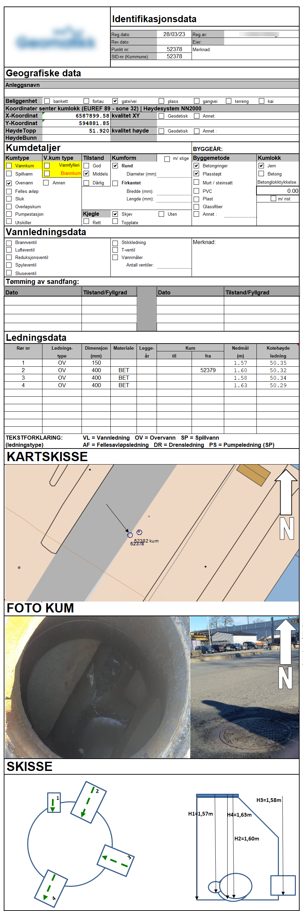

# Getting started

JKUM consist of a set of specifications for managing and transporting 
information that can be found when inspecting manholes. Since not all data
is accessible at the time after pipes has been laid, the information in
general file formats[^1] does not take into consideration that only one end of
the intersecting pipes can be seen. Thus: the need for detailed specification
of what can be seen inside a manhole when opening it. 

  [^1]:
    There are several file formats, but none that covers all the requirements we've
    identified in our works with this standard.
    

## Uses of this file format
The JKUM file format can be used for:

- Registering data seen when opening manholes, and allowing easy transport of all data
  the surveyor finds, without any losses.
- Interaction of concepts for pipe systems between applications and APIs.

## Why do we need a new file format?
Current practice of registrating the contents of the insides of manholes 
involves people going out into the field, and either:

- Writing down the measurements and a sketch on a piece of paper.
- Entering the registrations into an app or similar system.

After that, the surveyor would go back into the office, and start managing the registrations,
and producing whatever might be of value to the client that ordered the survey in the first place.
Often, such end results would be a PDF per manhole, or in best cases: an Excel spreadsheet.

However, the registration is not standardized anywhere, and thus there are as many ways to
register this as there are surveyors. The need of a unified and supported mechanism for transporting
this kind of data is dire!

### Examples of current status
The current status can be represented here:

<figure markdown>
  { width="450" }
  <figcaption>This shows a sample of the current "kumkort" implementations as used
  by most surveyors in Norway. All surveyors apply their own implementation, and
  there are lots of variants to this.</figcaption>
</figure>

### Existing file formats
Currently, there are several file formats that may or may not be suited to
transporting data about surveying and registering manhole data. However, we've
found that none of them truly serves the purpose of the "kumkort" that's currently
the de-facto "standard"[^2] of the field. 

  [^2]:
    There are no standard. Every surveyor is expected to represent each manhole
    with some core data, like elevations, dimensions of pipes etc. How they go about
    it, is all up to them.
 
Here, we try to summarize existing file formats and standards, and why they don't cover
the needs covered by this standard.


=== "SOSI"

    ``` txt

    Pros:
    
    - Well established file standard that's been around since the 1980's. 
    - Rectified by the Norwegian mapping authorities.
    - Maintained and documented.
    
    Cons:
    
    - Limited in how to represent what can be seen inside a manhole.
    - Dependant on knowing where the other end of the pipe is (which you don't know
      when looking down into a manhole, unless you can also find the other end).
    - Complex implementation in GML with lots of objects and alternatives. 
      Not focused on manholes and its contents.
    - Pure Norwegian standard. Not used in other countries.
    ```
    
=== "KOF"

    ``` txt
    
    Pros:
    
    - Very simple to implement
    - Easy to read and understand
    
    Cons:
    
    - Relies on old SOSI codes, which has been deprecated for a long time.
    - Not manhole-oriented. Relies on the need to know where the other end of
      the pipe is situated. Cannot represent a manhole by itself.
    - Can not represent a manhole as a single object. In order to cover all aspects
      of a manhole, it needs to create lots of different objects that may or may not
      be related
    ```
    
=== "IFC"

    ``` txt
    Pros:
    
    - Well established file standard that's in use within the construction domain.
    - Integrates well into AEC-tools (Architechture, Engineering and Construction)
    
    Cons:
    
    - Complex file standard with lots and lots of different supported objects.
      It is also more building-oriented, and does not fully support details 
      for manhole objects.
    - File contents can have lot of freedom when it comes to properties and
      property sets. There is a huge risk that different vendors will apply
      different names for properties, thus making information transport difficult.
    
    ```

Overall, we're led to the conclusion that no file format exists that can truly
cover all we want to know about a single manhole, without relying on lots of
other objects (the pipes) or doing geometric calculations to identify angles for
inlets or outlets.
